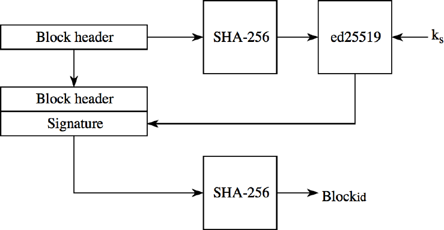

# Lisk Blocks 

A blockchain is composed of blocks. Each block is composed of a header and a list of transactions. When a delegate is assigned a slot in a delegate round, and has their node running, that delegate generates the next block and confirms up to 25 transactions from the transaction pool. These confirmed transactions will be added to the payload of the block and subsequently signed by the delegate.

## Block Header
The block header contains all the information about the block. The following fields compose the block header:

- A 64 bit Id of the block.
- A 32 bit integer identifying the version of the block.
- A 32 bit epoch timestamp of when the block was created.
- The 64 bit Id of the previous block.
- A 32 bit integer corresponding to the number of transactions processed in the block.
- A 64 bit integer corresponding to the block height.
- A 64 bit integer corresponding to the total amount of Lisk transferred.
- A 64 bit integer corresponding to the total amount of fees associated with the block.
- A 64 bit integer corresponding to the LSK reward for the delegate.
- A 32 bit integer corresponding to payload length.
- The 256 bit hash of the payload.
- The 256 bit public key of the delegate who generated the block.
- The 512 bit signature of the block by the delegate.

The figure below is an example representation of a block header  in JSON containing all fields described above. 

```json
     {
      "id": "15787022670460703397",
      "version": 0,
      "timestamp": 23039010,
      "height": 1574052,
      "previousBlock": "4576781903037947065",
      "numberOfTransactions": 0,
      "totalAmount": 0,
      "totalFee": 0,
      "reward": 500000000,
      "payloadLength": 0,
      "payloadHash": "e3b0c44298fc1c149afbf4c8996fb92427ae41e4649b934ca495991b7852b855",
      "generatorPublicKey": "c0ab189f5a4746725415b17f8092edd3c266d1e758e840f02a3c99547b3a527f",
      "blockSignature": "c6b2bcc960066be078efbfffed625f61553a7bc18ebde3892636c2f36850de234a9c70ba3e33b606db2eff724398026984e4d391c1fbbe70c94dd9d07ff0060b"
    }
```

The process for signing the block header is the same as the process for signing a transaction. When hashing the block header in order to compute the block signature, the values of the fields are considered in the following order:


The block header is hashed using SHA-256 and signed using delegate's secret key. Then the first 8 bytes of the output are reversed and used as the blockId (following the same logic as with transaction signatures). 

A signed block generates its blockId using the following flow:



##Block Payload
The payload of the block is comprised of up to 25 transactions present on the system signing the block. The maximum number of available transactions up to this limit will be included, provided that the payload for a transaction does not exceed the maximum size for each transaction type. 

These maximum sizes are listed below:

**Transaction Type** | **Maximum Size (bytes)**
--- | ---
Type 0 | 220
Type 1 | 149
Type 2 | 201
Type 3 | 2,326
Type 4 | 1,223

The maximum size of a block payload can then be determined as 58150 bytes if every transaction is type 3 and contains the maximum number of assets. A data block is composed using the gathered unconfirmed transactions’ data blocks and signatures. The system then hashes the combined transactional data blocks to generate the payload hash for the block header.

## Block Generation

Block generation occurs every 10 seconds within the Lisk network using a DPoS (Delegated Proof of Stake) consensus protocol. Delegates further use [broadhash consensus](../consensus#broadhash-consensus) as a guidance strategy to generate the block in order to prevent forks in the network.
