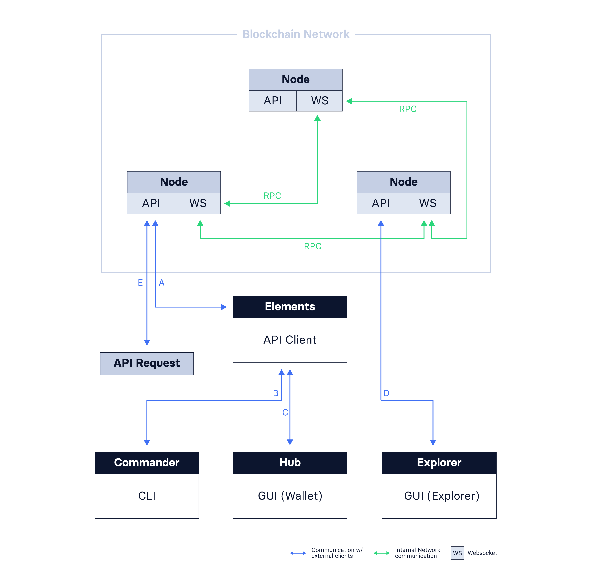

# Interact with the network

## What does it mean to interact with the network?
Every action that puts data on the blockchain, or gets data from it, is an interaction with the blockchain network. 

## Who or what interacts with the network?

- __1. Exchanges__ interact heavily with the network, e.g. by transferring tokens for their customers. We highly recommend exchanges to [set up  a node](maintain-node.md) to interact with the network reliably.
- __2. Delegates__ interact with the network by forging new blocks and adding them to the blockchain. A delegate is also typically a __node operator__.
- __3. Node operators and developers__ have a general interest in monitoring their node and the network. Their node provides them with a private API that can be used to make different queries or to post transactions to the network. Depending on their preferences, node operators might want to use [Lisk Commander](#a-use-the-command-line), [Lisk Elements](#b-write-scripts-in-javascript) or a graphical interface like [Lisk Hub](#c-use-lisk-hub).
- __4. Applications__ interact through the API with the network. For convenience, applications would use wrappers like [@liskHQ/lisk-api-client](../lisk-sdk/lisk-elements/packages/api-client.md). 
- __5. LSK Token Holders__ mostly interact with the network through Graphical User Interfaces such as wallet applications like [Lisk Hub](https://lisk.io/hub) or Lisk Mobile.

## How to interact with the network?

> The following tools are suited for interacting with the Mainnet and Testnet of Lisk. They can also be used to interact with other blockchain applications that have been developed using the Lisk SDK.

You can choose from up to 5 ways to interact with an existing network based on what is most convenient for your needs:

### A. Write scripts in Javascript
[Lisk Elements](../lisk-sdk/lisk-elements/introduction.md) is a collection of Javascript libraries that help applications to interact with the network.

On the [Packages page](../lisk-sdk/lisk-elements/packages.md) of Lisk Elements, all available libraries are listed and documented.

One of the most useful packages in this regard is the [@liskhq/lisk-api-client](../lisk-sdk/lisk-elements/packages/api-client.md) as it provides a slick interface to interact with the network in Javascript.

### B. Use the Command-line
[Lisk Commander](../lisk-sdk/lisk-commander/introduction.md) is the CLI-tool that lets you interact with the network conveniently through the command line. See a list of all commands and their example responses on the [Commands page](../lisk-sdk/lisk-commander/user-guide/commands.md).

### C. Use Lisk Hub
[Lisk Hub](https://lisk.io/hub) is the Graphical User Interface (GUI) to interact with the network.

It consists of wallet functionalities like sending transactions and viewing account history, as well as more extended features like delegate voting or registering as a delegate.

### D. Lisk Explorer

[Lisk Explorer](https://github.com/LiskHQ/lisk-explorer) is a web application that visualizes the vast information from Lisk's blockchain.

Lisk offers Explorers for the 2 public networks:
- [Lisk Explorer Mainnet](https://explorer.lisk.io/)
- [Lisk Explorer Testnet](https://testnet-explorer.lisk.io/)

The source code of Lisk Explorer is open source and can be utilized to set up own Explorers to visualize activity inside the network and to monitor it.

### E. Query the API

Query the [API](https://lisk.io/documentation/lisk-core/api) manually. Either from a public node, or connect to your own private node to interact with the network.

> View the full specification of the Lisk API, including example queries at [lisk.io/documentation/lisk-core/api](https://lisk.io/documentation/lisk-core/api)

To execute the query,  use any tool suitable for HTTP API requests.

__Popular tools for HTTP requests:__

- [Curl](https://curl.haxx.se/): Perform API requests from the command-line.
- [Postman](https://www.getpostman.com/): user friendly graphical interface for sending API requests.
- [Swagger UI](https://lisk.io/documentation/lisk-core/api): A Webinterface that can send API requests in addition to providing the complete API specification.

#### Use a public node

There are a number of nodes that are available for public use.

LiskHQ for example is running a public testnet node, that is also used to make [live requests](https://lisk.io/documentation/lisk-core/api) while trying out the different API endpoints in the documentation.

> When hitting the "Try it out" button beside each endpoint, it is possible to execute the corresponding API request and get a live response from Lisk Testnet.
> It will also display the corresponding curl command to make the request from the command-line.

#### Use your private node

When [setting up Lisk Core](maintain-node.md), the API will be private by default, which means API requests will be only accepted from localhost.

To change this, it is possible to define exclusive [whitelists](../lisk-core/configuration.md#api-access-control), that allow specific addresses to perform API requests on that node.
