# Lisk Hub Documentation

Lisk Hub is an all-in-one solution to manage your Lisk ID, access and send LSK tokens, as well as vote for delegates. It combines functionality from the former wallet and blockchain explorer. In the future, Lisk Hub will feature a DEX (decentralised exchange), Sidechain's registration and the ability to launch your own ICO.

## Table of contents

- [Download](#download)
- [Upgrade](#upgrade)
- [Features](#features)
  - [Lisk URLs](#lisk-urls)
  - [Network switcher](#network-switcher)
  - [Dashboard](#dashboard)
  - [Transaction history](#transaction-history)
  - [Send transaction](#send-transaction)
  - [Request LSK](#request-lsk)
  - [Bookmarks](#bookmarks)
  - [Sign message](#sign-messages)
  - [Voting](#voting)
  - [Hardware wallet support](#hardware-wallet-support)
  - [Create account](#create-account)
  - [Second passphrase](#second-passphrase)
  - [Auto-logout](#auto-logout)
  - [Local currencies](#local-currencies)
- [Contribute to the Codebase](#contribute-to-the-codebase)

## Download

In order to download Lisk Hub, you can either go to [Lisk Products](https://lisk.io/products) and download Lisk Hub there, or you can go directly to [Lisk Hub Releases](https://github.com/LiskHQ/lisk-hub/releases) to pull the desired release from our GitHub repository.

## Upgrade

### Automatic notification

Lisk Hub has a built in notification system to alert you when a new version is available:

### Checking for updates

In case you dismissed the upgrade, you can double-check by going to `Help` > `Check for updates...` in the menu:

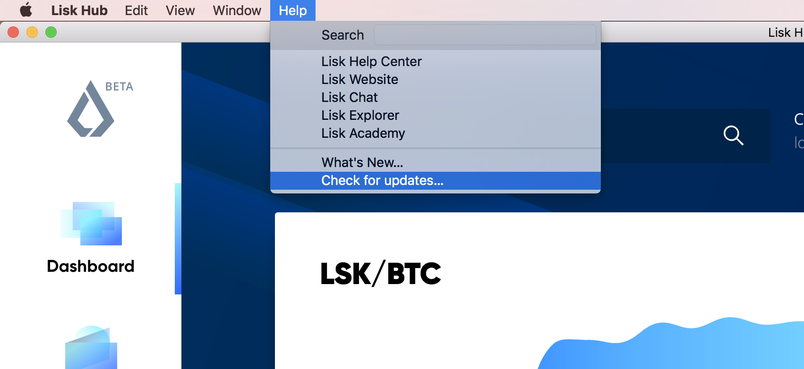

## Features

### Lisk URLs

After installing Lisk Hub on your device you will be able to use the `lisk` protocol. Example: `lisk://wallet`.
Everything that comes after `lisk://` is treated as a route so this example will open the Lisk Hub app on the wallet page.

> When clicking on a Lisk URL, the system opens Lisk Hub (if it is installed) directly on a desired page. It can prefill certain fields or enable certain features in Lisk Hub on the fly.

### Network switcher

> The default network Lisk Hub will try to connect to is the Lisk Mainnet.
> The network switcher on the login page is not visible by default, but can be enabled from the settings page or alternatively through Lisk URL.

*Lisk URL:* `lisk://login?showNetwork=true`

Opens the login page and enables the network switcher options.
A new option will appear on the login screen, that allows the user change the network, or to specify a concrete custom Node, Lisk Hub should connect to.

### Dashboard

The Dashboard provides an overview about recent transaction, market price changes, and recent social media updates of Lisk.

It also provides a list of all added [Booksmarks](#bookmarks) and the option to add new ones.

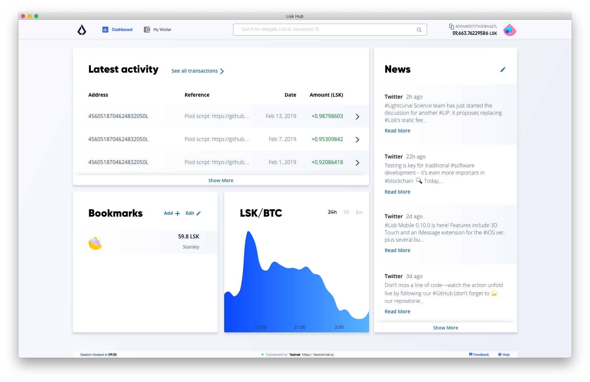

### Transaction history

The transaction history provides a chronological overview about all transactions associated with this account on the Lisk blockchain.

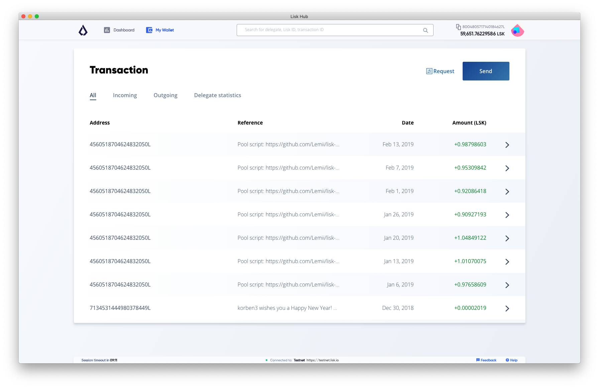

The "Account Info" page displays information about the casted votes of an account.

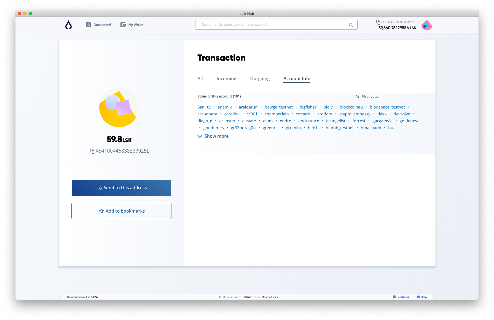

In case the respective Lisk ID did register a delegate on the network, there will be a "Delegate stats" instead of the "Account info" page, which will display additional information, like a list of accounts that have voted for that particular delegate, and some general statistics about the productivity of the respective delgate.

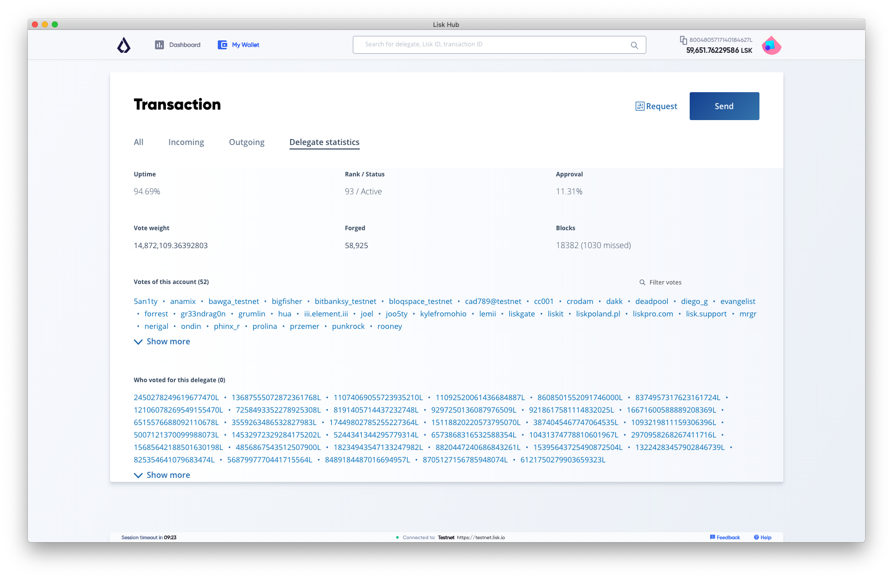

### Send transaction

Send transactions with Lisk Hub by navigating to the "Wallet" page and hit the "Send" button.
On the next page, it is needed to specify the recepient address and the amount of LSK that should be send.
The Reference is an optional data string, that will be connected to the transaction.
It can be a custom string of 64 bytes and is often used as reference, what the transaction is about.

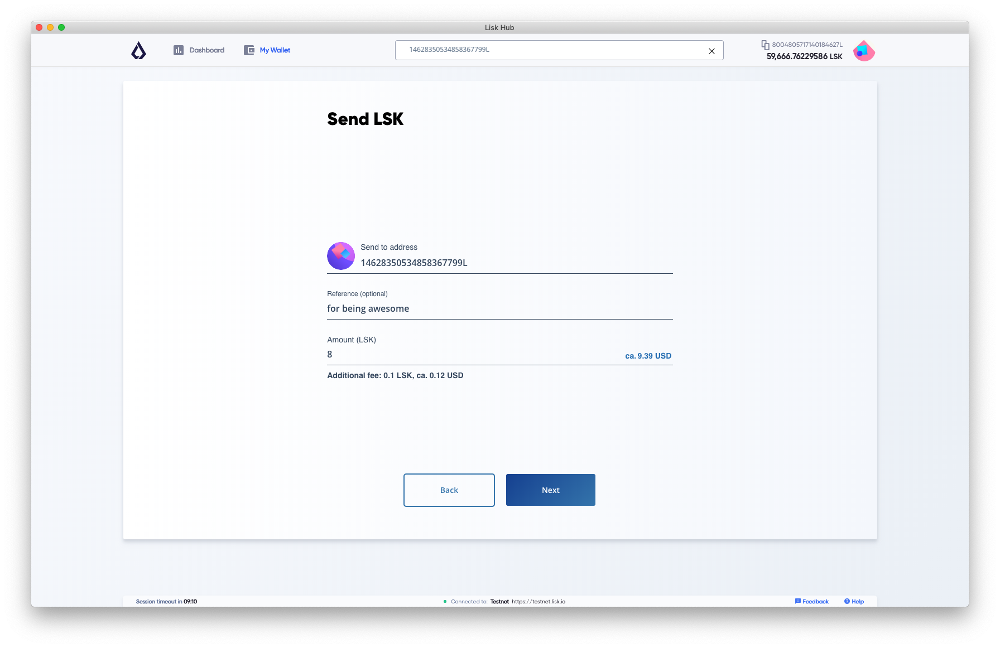

### Request LSK

LSK can be requested from the "Wallet" page of Lisk Hub. Hit the "request" button on the upper right corner.
Lisk Hub offers different ways to request LSK from people:
 
 - request LSK via email
 - request LSK via QR-Code
 - request LSK via Lisk URL *(described below)*

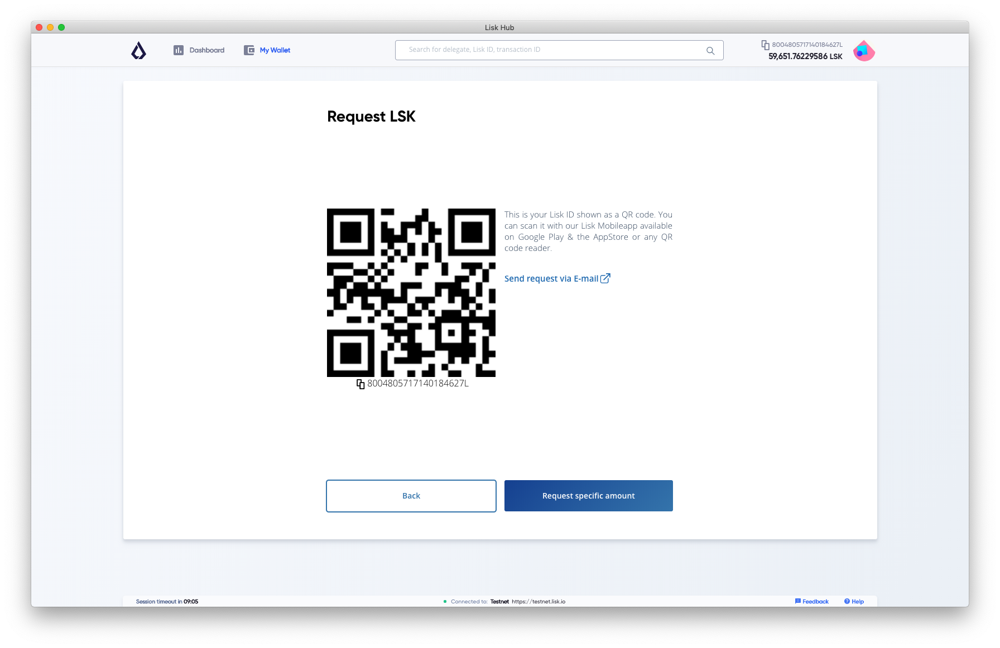

By clicking on "Request specific amount" button, Lisk Hub will help you to create a link with the recipient(in that case your Lisk ID) and the amount of LSK, you want to receive.
Then post it to the person you want to receive LSK from.
By clicking on the link, Lisk Hub will open (if installed on the system) and prefill amount, recepient and reference for the user, so he/she only needs to hit the send button to send the tokens.

*Lisk URL example:* `lisk://wallet/send?recipient=8004805717140184627L&amount=8&reference=for being awesome`

Opens the wallet and prefills the send form with recipient and amount.
We use `14628350534858367799L` for the address and `8` LSK for the amount.

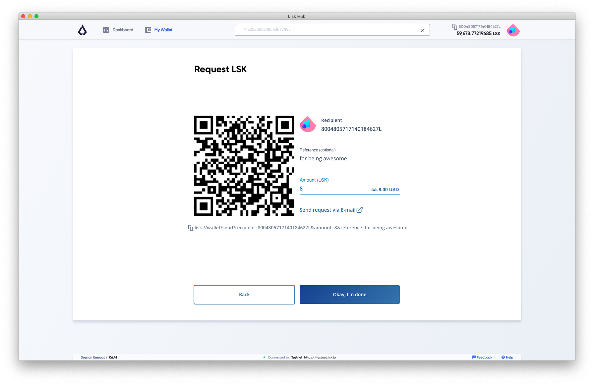

### Bookmarks

Lisk Hub supports to create Bookmarks of accounts. Bookmarks work basically like an address book.
The user can save his*her favorite Lisk addresses with name, what makes finding and recognizing addresses much more simple.

When sending LSK with Lisk Hub, the user may choose conveniently among the already created bookmarks.

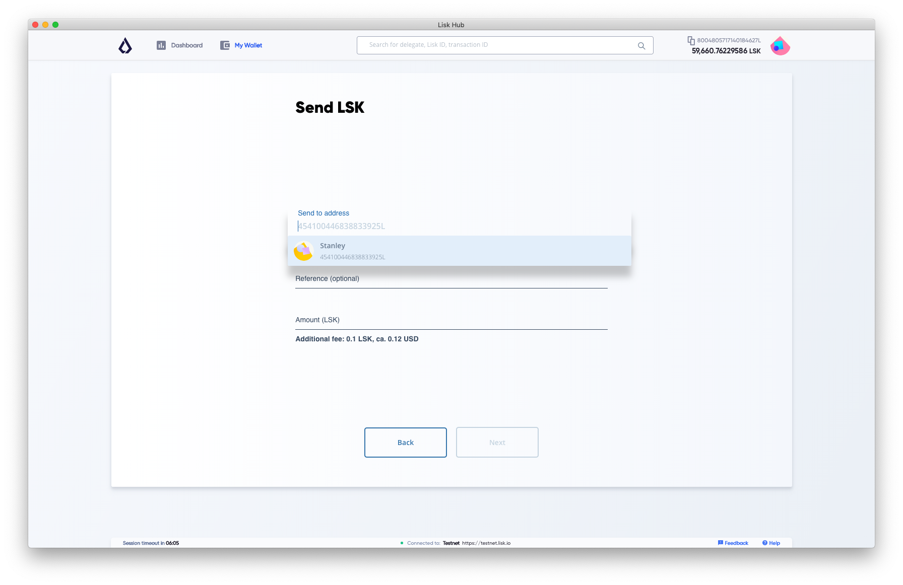

### Sign message

> This feature is not accessible through the GUI (graphical user interface) of Lisk Hub.
> To sign a message, use the Lisk URL below. 

Opens the sign message form and prefills it with your message.
As an example we use `i love lisk hub`.

*Lisk URL example:* `lisk://sign-message?message=i love lisk hub`

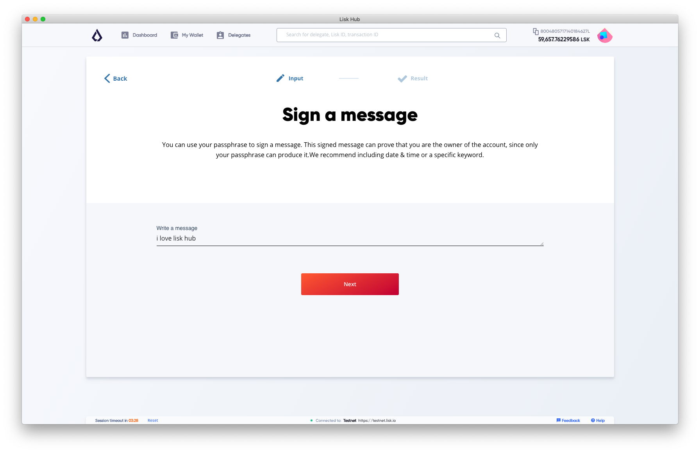

The signed message will look like this:

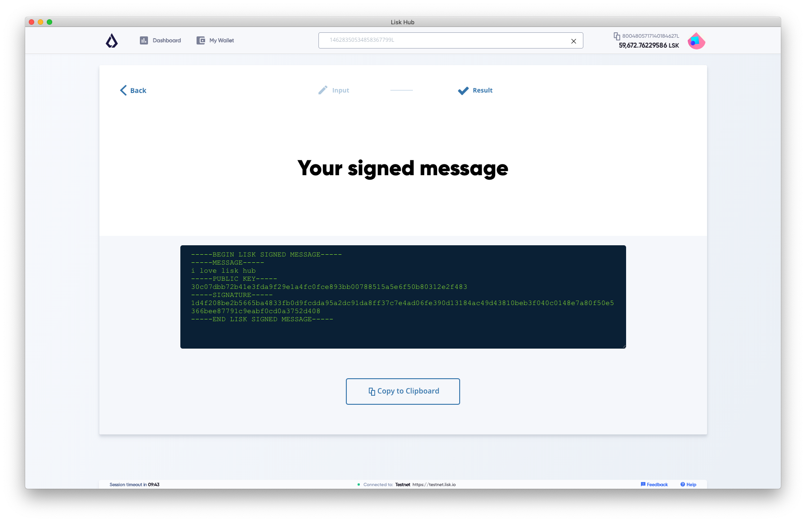

### Voting

Makes voting for delegates easier. 
As example, we want to vote for `samuray` and `slasheks` and unvote `vipertkd`.

*Lisk URL:* `lisk://delegates/vote?votes=samuray,slasheks&unvotes=vipertkd` 

This will open the Lisk app and automatically select the delegates `samuray` and ` slasheks` for upvoting and `vipertkd` for unvoting.

The below screenshot displays how it looks, if the votes are set manually inside the GUI.

### Hardware wallet support

Lisk Hub supports [Ledger Nano](https://www.ledger.com/) hardware wallets.
Support for more hardware wallet models is planned to add in future versions.

Steps to connect your Ledger Nano with Lisk Hub:

1. Connect your Ledger Nano with the computer and login by entering your secret PIN on the Ledger Nano.
2. Install the Lisk app on your Ledger Nano via [Ledger Live](https://www.ledger.com/pages/ledger-live).
3. Open the Lisk Hub sign-in page.
It should recognize your connected Ledger Nano, and offer an additional login method "Hardware login".
4. Open the Lisk app on the Ledger Nano.
5. Click on the link named after your Ledger device after "Hardware login".
6. Pick your account on the "Accounts on Ledger" page.

The login page with recognized hardware wallet device.

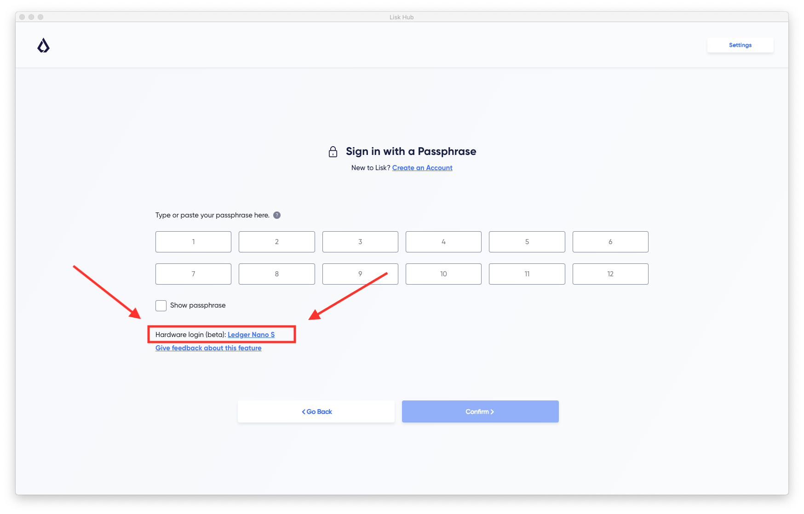

If you see this page, Lisk Hub is successfully connected to your Ledger device.

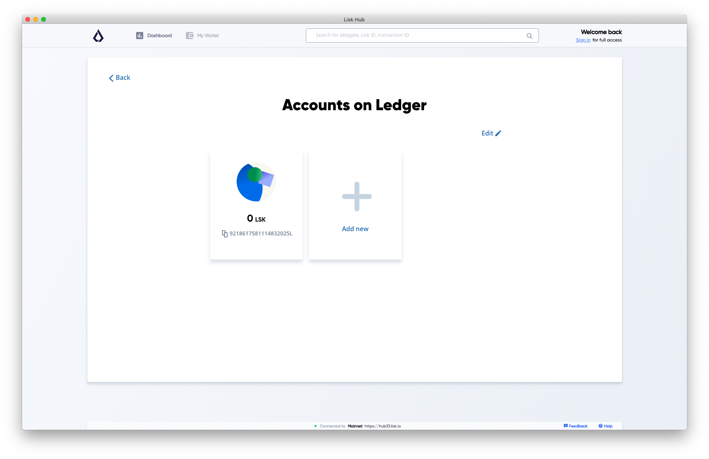

### Create Account

The most convenient way to create your personal Lisk ID within a few seconds.
On the login screen of Lisk Hub, hit "Create an Account".

After a few clicks, the account creation is completed.

> **Important:** Make sure to keep your secret passphrase safe, that is generated during account creation.
> The secret passphrase will be the only way to access your wallet.

### Second passphrase

On the settings page you can register for a `second passphrase` for a fee 5 LSK.

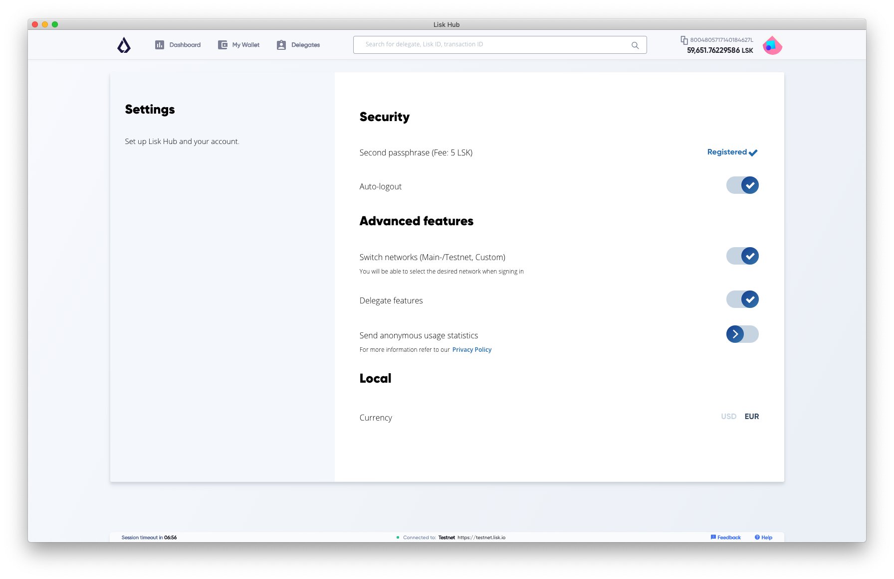

The second passphrase will be prompted each time the account performs important actions, like sending transactions or voting.

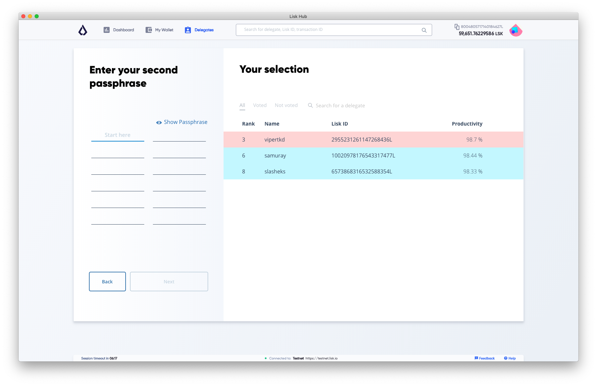

### Auto-logout

Auto-logout is a security feature that automatically logs out, if the User has not performed any actions inside of Lisk Hub during that time.

It is possible to turn it off on the Settings page.

> Turning it off temporarily can make sense, e.g. during voting process, as it may log you off in the middle of it, if you spend more than 10 minutes on the selection page.
> In that case, dont forget to turn it back on after the voting process.

### Local Currencies

On the "Settings" page, you can select your preferred currency conversion.

Currently supported:
- $ (USD)
- € (EUR)

## Contribute to the Codebase

Everyone is invited to contribute to the Lisk Hub project. We welcome and appreciate all contributions. 

### Github
All necessary information can be found on our [Lisk Hub Github](https://github.com/LiskHQ/lisk-hub).

### Contribution Guidelines
Please be sure to read and follow our [Contribution Guidelines](https://github.com/LiskHQ/lisk-hub/blob/development/docs/CONTRIBUTING_GUIDE.md).

### Gitter
If you have any further questions please join our [Gitter](https://gitter.im/LiskHQ/lisk).
