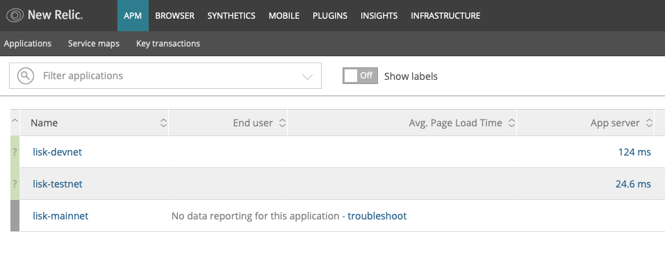
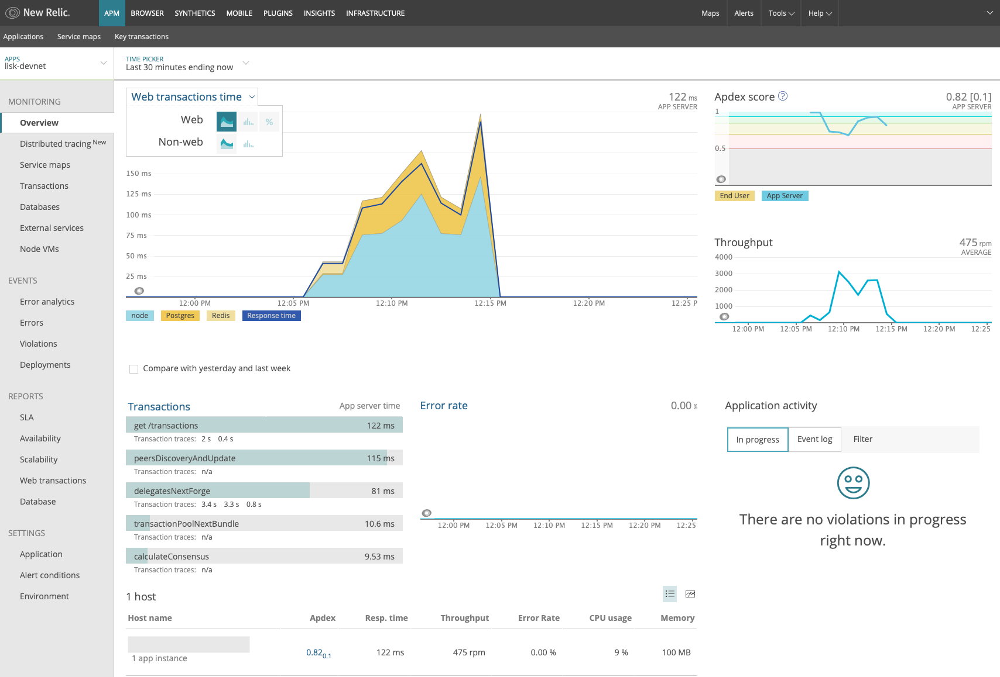
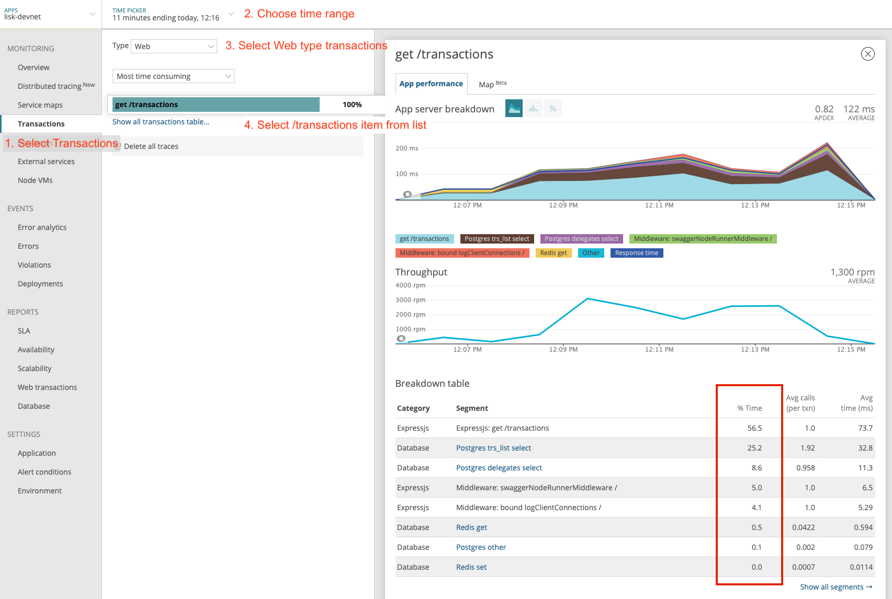
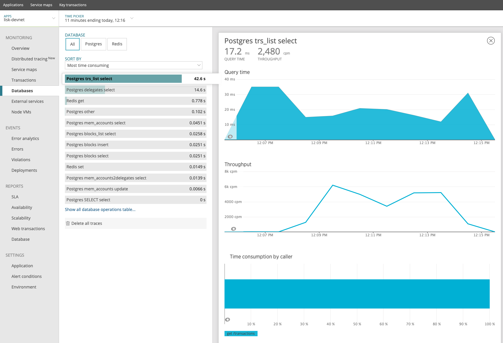

# Performance Monitoring

We use [New Relic](http://newrelic.com/) to monitor the activities inside of the application. It provides the user with a detailed insight into the system and keep track of the performance of any activity, e.g. an HTTP API call or a background process from Lisk Core jobs queue.

Following steps should provide you with the insights of why and how to monitor your Lisk Core node using New Relic instrumentation: 

1. [Enable New Relic](#enable-new-relic)
   1. [Get New Relic license key](#get-new-relic-license-key)
   2. [Add license key](#add-license-key)
      * [Option 1: As environment variable](#option-1-as-environment-variable)
      * [Option 2: In newrelic.js](#option-2-in-newrelicjs)
   3. [(Re)start Lisk Core node](#restart-lisk-core-node)
2. [Keep your node busy](#keep-your-node-busy)
   * [Option 1: Lisk Core Test Suite](#option-1-lisk-core-test-suite)
   * [Option 2: Apache Bench](#option-2-apache-bench)
   * [Option 3: Siege](#option-3-siege)
   * [Option 4: Custom script](#option-4-custom-script)
3. [Analysis with New Relic](#analysis-with-new-relic)
4. [FAQ](#faq)

## Enable New Relic

### Get New Relic license key

First thing you need to do is register an account at https://rpm.newrelic.com, if you have not already done that.
After successful login, select "Account settings" in the account dropdown in the New Relic UI.
From the Account information section on the right side of the Summary page, copy your license key.

### Add license key

#### Option 1: As environment variable

To enable the performance monitoring on your node, make sure you have an environment variable `NEW_RELIC_LICENSE_KEY`
set:

##### Binary & Source

The following command works for Lisk Core Binary and from Source distributions:
```bash
export NEW_RELIC_LICENSE_KEY=XXXXXXXXX
```

##### Docker

For Docker distributions of Lisk Core, do the following to add the environment variable:

```bash
cd lisk_repo
vim docker/docker-compose.override.yml
```

Add your license key to `docker-compose.override.yml` like so:

```
version: "3"
services:

  lisk:
    environment:
      - NEW_RELIC_LICENSE_KEY=XXXXXXXXX
```

Then, save your changes and update Dockerfile so that it can use the new environment variable.

```bash
<esc> # press esc to quit insert mode of vim
:wq # save changes and quit vim afterwards
docker-compose up -d # (re)start docker containers
```


#### Option 2: In newrelic.js

The second way of adding the license key is to edit `newrelic.js` file which can be found in the root directory of the Lisk Core installation.

```bash
cd lisk_repo # navigate inside the root folder of lisk core
vim newrelic.js
```

Inside of the file, search for the option `license_key` and add your license key as string value.
If you use "vim", press `i` to get into the insert mode.

```
/**
 * Your New Relic license key.
 *
 * MUST set the license key using `NEW_RELIC_LICENSE_KEY` env variable
 * if you want to enable the monitoring of the lisk node
 */
license_key: 'XXXXXXXXX',
```

After adding the license key, save changes and quit the editor:

```bash
<esc> # press esc to quit insert mode of vim
:wq # save changes and quit vim afterwards
```

### (Re)start Lisk Core node

Then start the node normally.

```bash
bash lisk.sh start # start lisk core binary
pm2 start lisk # start lisk core source
docker start container_id # start lisk core docker
```

... or restart if it is already running.

```bash
bash lisk.sh reload # restart lisk core binary
pm2 restart lisk # restart lisk core source
docker restart container_id # restart lisk core docker
```

## Keep your node busy

To monitor activities in the system, you need to perform some. So keep your node busy by performing actions like taking a snapshot, syncing your node, or running various API request against it.
Even if you don't perform them, New Relic can monitor internal activities of the system e.g. different queue jobs.

There are several ways to create workload on your node:

### Option 1: Lisk Core Test Suite

Info | Note 
--- | --- 
 | The Lisk Core Test Suite is only available for Lisk Core from Source.

Info | Note 
--- | --- 
 | The `unit` Testsuite is not suited for this purpose, as unit tests are not executed in the context of the running application.

Tests are run using the following command:

```bash
npm test -- mocha:<tag>:<suite>:[section]
```

* Where **tag** can be one of `default | unstable | slow | extensive` (required)
* Where **suite** can be one of `unit | integration | functional | network` (required)
* Where **section** depending of the chosen suite can be:
* when `functional` --> `get | post | ws` (optional)

Examples:

```bash
npm test -- mocha:extensive:integration
npm test -- mocha:default:functional
npm test -- mocha:unstable:functional:get
npm test -- mocha:untagged:network
```

Individual test files can be run using the following command:

```bash
npm run mocha -- path/to/test.js
```

### Option 2: Apache Bench

[Apache Bench](https://httpd.apache.org/docs/2.4/programs/ab.html) is a generic benchmarking tool to measure the performance of HTTP servers.

Do e.g. the following request:

```bash
now && ab -n 200000 -c 1 -k "http://127.0.0.1:7000/api/accounts?publicKey=4e8896e20375b16e5f1a6e980a4ed0cdcb3356e99e965e923804593669c87ad2"
```

`now`: Appends the current system time on top of the Apache Bench output. In case you want to compare New Relic benchmark results with Apache Bench output, it is convenient to add it for knowing when the benchmark started exactly, as Apache Bench is not logging that itself.

`-n`: The number of requests that are executed

`-c`: The number of requests to perform in parallel.

`-k`: Enable the HTTP KeepAlive feature, i.e., perform multiple requests within one HTTP session.

### Option 3: Siege

[Siege](https://www.joedog.org/siege-manual) is another tool for benchmarking the performance of HTTP servers.

Do e.g. the following request:

```bash
siege -c 10 -t 30m http://127.0.0.1:7000/api/blocks
```

`-c`: Number of requests to perform in parallel.

`-t`: Allows you to run the test for a selected period of time.

### Option 4: Custom script

Feel free to write your own custom scripts and specify the order and amount of actions you want the node to perform during the analysis, depending on a special use case or a scenario you want to benchmark.

## Analysis with New Relic 

Let's take a case study, we want to analyze the performance of API `GET /api/transactions` endpoint, to figure out: 

1. If there is any bottle neck in the database level 
2. Which of the database query is taking most of the time

Here are the steps we follow: 

```bash
$ cd ~/lisk_repo 
~/lisk_repo $ export NEW_RELIC_LICENSE_KEY=xxxxxxxxxxx
~/lisk_repo $ pm2 start lisk
```
Now start making some requests using Siege:

```bash
siege -c 10 -t 5m http://127.0.0.1:4000/api/transactions
```

The script will automatically keep on sending the HTTP requests against your node for 5 minutes (`-t 5m`). During that time please keep in mind: 

1. You may want to disable the cache on the node to get real performance analysis. To do this, set `cacheEnabled` in configuration to `false`.
2. You might not see the viable results if your development blockchain dataset is empty. This could be changed by running your tests against the Testnet data.
3. It may take a couple of minutes to show the analyzed results in the New Relic interface so be patient. 
  
To see the New Relic instrumentation results, please log in to https://rpm.newrelic.com, and select `APM` from the top menu. 

The first screen is the list of applications. Depending on which network you run your node in, you will see the application title as shown in the image below. 
  
 

Please select the specific application by clicking its name. You will see the following dashboard:  

 

To know fine-grained details of this dashboard, please read https://learn.newrelic.com/courses/intro_apm. For now, since during the experiment we only executed the HTTP requests against our node (`GET /api/transactions`), there is only one section having interesting results. Please select "Transactions" from the left menu in above screen. See detailed instructions in the below image. 

Info | Note 
--- | --- 
 | To clarify, New Relic transactions have no relation with Lisk transactions. It's just the grouping term New Relic use to show analytics. 




In the above image the most valuable information for us is highlighted in the rectangle, which provides us with the following information: 

1. Most of the time (56%) was spent in ExpressJS which is a Node.js module. 
2. During the experiment, one database view (`trs_list`) and one database table (`delegates`) were involved in the persistence layer.
3. Querying to database table `delegates` was quick.
4. While query to database view `trs_list` was a bit expensive.
5. On average API calls for `GET /api/transactions` took 122ms.

If you want this information in a tabular form to present somewhere, please click on "Show all transactions table" link. Then you will see a view like this. 


From this screen you can see: 

1. In selected time range we made 14252 total requests to `GET /api/transactions`.
2. The slowest request took 2.17 seconds time.
3. The fastest request took 10ms.
4. Average time for requests is 122ms while standard deviation is 213ms. 
5. Difference between average and standard deviation shows there were small spikes between requests.
6. You can export data to CSV format from this screen to keep record or share with others. 

Now if we want to debug deeper which transactions actually took 2.17 seconds, please go back to previous screen, scroll down a bit and you will see transaction traces. 


Here you can see an overview of an individual transaction which took longer time and is considered as "slow". The threshold which defines the "slow" transactions is configured in file `newrelic.js` under `transaction_tracer.explain_threshold`, which is currently 100ms- every request which took more than 100ms will be considered as "slow" and logged as the trace by New Relic.
Let's debug further and verify what made this request "slow", by clicking on any of the trace links in the list. 


As shown on the above trace summary, the most of the transaction's time was spent in two functions `modules.transactions.shared.getTransactions` and `Middleware: bound logClientConnections`. You can go to trace detail to see more information and call stack. You can also click on "Database queries" to see which queries were executed during this request.

It's also possible to find the database query which is taking most of the time. To do this, please click on the left side menu for "Database" and then sort by "Most time consuming" and then select the top of the list.   



Scroll down on the page shown above, you will see the slow queries shown below:  


By analyzing the above diagrams, we can conclude the following assuming that all stats are strictly within experiment time range:

1. The slowest queries in the system are queries for `trs_list` view.
2. For that database view `trs_list` the slowest query is the `SELECT count(*) FROM trs_list` which took 2.13 seconds.
3. There are few other queries in the on `trs_list` view which took more than 1 second time. 
4. If you click on the top slow query, you will notice the query was executed during `GET /api/transactions`.


We hope the above use case helps you to understand the usage and benefits of New Relic. Please let us know if you want to know more. 

## FAQ

**I am not seeing Lisk Data in the New Relic APM dashboard?**

Please make sure to check following. 

1. Are you using a valid license key to your account?
2. Have you exported the license key on the node where you are running Lisk?
3. Have you selected proper time range in New Relic APM?
4. Are you looking on right page? E.g. you may be searching web transactions but you had selected Non-Web transactions in UI.
5. If you just run the node, give it few minutes let New Relic to crunch the data and show in UI. 

**Are the performance measures consistent?**

1. As far as you are using same machine specification to run different scenarios, the stats will be consistent.
2. We recommend to not benchmark on your development machine, as it can have other work load during different test runs.
3. If you are using AB or Siege, always use same number of connections to simulate same request load on node. 

**How is it useful for me as a Delegate or Exchange?**

1. Performance of the machine may effect the behavior of interacting with the node.
2. You can create alert policies on New Relic to inform you when your app taking more memory.
3. You can set alerts to see if database is getting slow.
4. You can track if some errors occurred in the system which were not handled properly.   
